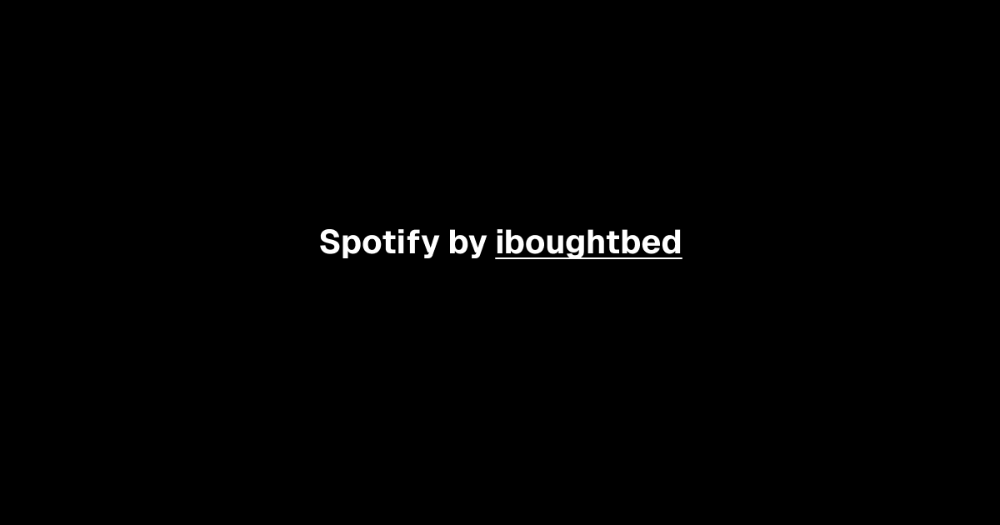

# [Spotify](https://iboughtbed-nf-hw-spotify-clone.vercel.app/)

This is an open source spotify clone build with everything new in Next.js 14. It is bootstrapped with `create-t3-app`.

[](https://iboughtbed-nf-hw-spotify-clone.vercel.app/)

## Tech Stack

- **Framework:** [Next.js](https://nextjs.org)
- **Styling:** [Tailwind CSS](https://tailwindcss.com)
- **UI Components:** [shadcn/ui](https://ui.shadcn.com)

## Features to be implemented

- [x] I'm just messing with you
- [x] But I loved her tho
- [x] And we ended it on good terms
- [x] But I miss her tho

## Running Locally

1. Clone the repository

   ```bash
   git clone https://github.com/iboughtbed/nf-hw-spotify-clone.git
   ```

2. Install dependencies using pnpm

   ```bash
   pnpm install
   ```

3. Copy the `.env.example` to `.env` and update the variables.

   ```bash
   cp .env.example .env
   ```

4. Start the development server

   ```bash
   pnpm run dev
   ```

## Introduction

This is nFactorial Incubator homework

## License

Licensed under the MIT License. Check the [LICENSE](./LICENSE.md) file for details.
